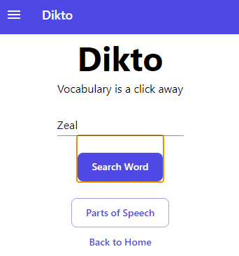
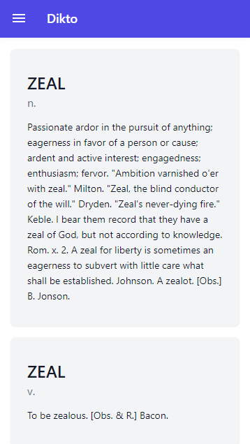
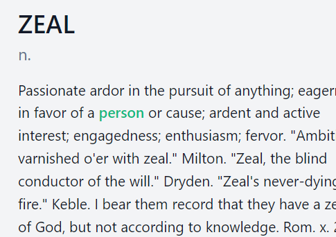
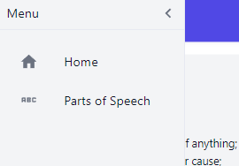
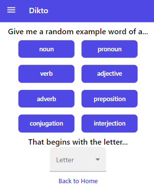

<!-- PROJECT SHIELDS -->
<!--
*** I'm using markdown "reference style" links for readability.
*** Reference links are enclosed in brackets [ ] instead of parentheses ( ).
*** See the bottom of this document for the declaration of the reference variables
*** for contributors-url, forks-url, etc. This is an optional, concise syntax you may use.
*** https://www.markdownguide.org/basic-syntax/#reference-style-links
-->

[![Contributors][contributors-shield]][contributors-url]
[![Forks][forks-shield]][forks-url]
[![Stargazers][stars-shield]][stars-url]
[![Issues][issues-shield]][issues-url]
[![MIT License][license-shield]][license-url]
[![LinkedIn][linkedin-shield]][linkedin-url]

<!-- PROJECT LOGO -->
 

    

  

    a cool little dictionary
     
    <a href="http://dikto-client.s3-website.eu-west-3.amazonaws.com/">Visit App</a>
    ·
    <a href="https://github.com/strauss02/dikto-frontend/issues">Report Bug</a>
    ·
    <a href="https://github.com/strauss02/dikto-frontend/issues">Request Feature</a>
  

<!-- TABLE OF CONTENTS -->

  
Table of Contents

  <ol>
    <li>
      <a href="#about-the-project">About The Project</a>
      <ul>
        <li><a href="#built-with">Built With</a></li>
      </ul>
    </li>
    <li>
      <a href="#getting-started">Getting Started</a>
      <ul>
        <li><a href="#prerequisites">Prerequisites</a></li>
        <li><a href="#installation">Installation</a></li>
      </ul>
    </li>
    <li><a href="#usage">Usage</a></li>
    <li><a href="#roadmap">Roadmap</a></li>
    <li><a href="#contributing">Contributing</a></li>
    <li><a href="#license">License</a></li>
    <li><a href="#contact">Contact</a></li>
    <li><a href="#acknowledgments">Acknowledgments</a></li>
  </ol>

<!-- ABOUT THE PROJECT -->

## About The Project

[![Dikto Screen Shot][product-screenshot]](https://example.com)

This application was built as a project in my coding course. It demonstrates the use of AWS Cloud Services, React and more.  
Dikto is a simple, lightweight dictionary app with some cool little features.  
This project represents a great ammount of effort and my advancement as a student in the programming world.

(<a href="#top">back to top</a>)

### Built With

 

- [React.js](https://reactjs.org/)
- Material UI
- AWS S3
- AWS DynamoDB

(<a href="#top">back to top</a>)

<!-- GETTING STARTED -->

## Getting Started

Go to [this link](http://dikto-client.s3-website.eu-west-3.amazonaws.com/) to get started with the app.

### Prerequisites

A modern browser.

(<a href="#top">back to top</a>)

<!-- USAGE EXAMPLES -->

## Usage

To get started with word definitions, write the word you'd like to define!

Then click the Search button.

Behold, the definitions for the word you entered shall now appear before you.

You can also click any word inside the definition. That will lead you to the definition of that word.

You can always go back and visit other sections by clicking the menu button.

The Part of Speech section allows you to get a random word as an example to a speech part. Simply click the part of speech you'd like to get an example of.  
And if you want, you can also choose a letter for that example word to begin with.

(<a href="#top">back to top</a>)

<!-- MARKDOWN LINKS & IMAGES -->
<!-- https://www.markdownguide.org/basic-syntax/#reference-style-links -->

[contributors-shield]: https://img.shields.io/github/contributors/othneildrew/Best-README-Template.svg?style=for-the-badge
[contributors-url]: https://github.com/othneildrew/Best-README-Template/graphs/contributors
[forks-shield]: https://img.shields.io/github/forks/othneildrew/Best-README-Template.svg?style=for-the-badge
[forks-url]: https://github.com/othneildrew/Best-README-Template/network/members
[stars-shield]: https://img.shields.io/github/stars/othneildrew/Best-README-Template.svg?style=for-the-badge
[stars-url]: https://github.com/othneildrew/Best-README-Template/stargazers
[issues-shield]: https://img.shields.io/github/issues/othneildrew/Best-README-Template.svg?style=for-the-badge
[issues-url]: https://github.com/othneildrew/Best-README-Template/issues
[license-shield]: https://img.shields.io/github/license/othneildrew/Best-README-Template.svg?style=for-the-badge
[license-url]: https://github.com/othneildrew/Best-README-Template/blob/master/LICENSE.txt
[linkedin-shield]: https://img.shields.io/badge/-LinkedIn-black.svg?style=for-the-badge&logo=linkedin&colorB=555
[linkedin-url]: https://linkedin.com/in/othneildrew
[product-screenshot]: images/scrnsht1.png
